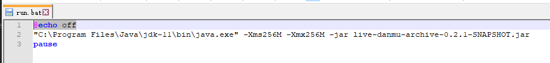
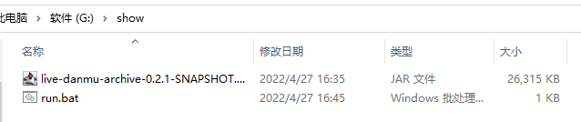
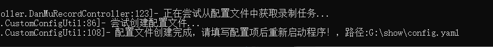
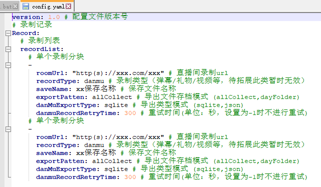
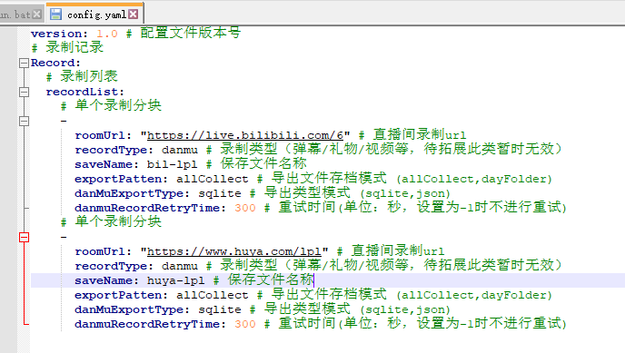
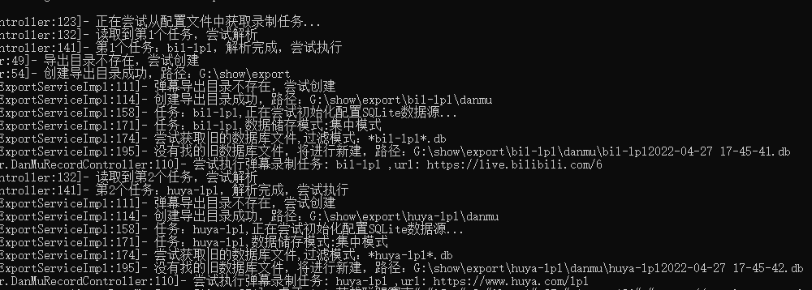
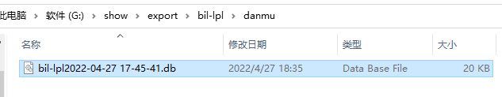

[comment]: <> (
)

[comment]: <> (  )

[comment]: <> (
)

  直播弹幕录制&存档

  
  
  
  
  

[comment]: <> (  <a href="https://github.com/cuteluobo/live-danmu-archive/actions/workflows/pre-build.yml">)

[comment]: <> (    )

[comment]: <> (  </a>)

## 内容目录

  
点我 打开/关闭 目录列表

- [内容目录](#nav-1)
- [项目介绍](#nav-3)
    - [背景](#nav-3-1)
- [功能特色](#nav-5)
- [TODO](#nav-6)
- [新手入门](#nav-7)
- [维护者](#nav-8)
- [贡献者](#nav-9)
- [更新日志](#nav-10)
- [特别感谢](#nav-11)
- [版权许可](#nav-15)

## 项目介绍

 此项目用于将各直播平台的弹幕进行录制存档，方便用于后续处理
- 开发环境：`OpenJdk11`
- 关键词: `直播弹幕录制`、`直播弹幕处理`
- 当前录制性能(v0.2.1)：
  - 运行时CPU和IO性能占用不高，主要是内存占用
  - 22-04-27 本地测试 未限制JVM内存参数时，
    - 基础运行内存120MB+;
    - 单B站头部主播（平均30弹幕/s）20任务,占用内存260MB+;
    - B站（平均30弹幕/s）20任务+虎牙赛事（平均50弹幕/s）10任务，平均占用内存400M

### 背景

- 目前在直播录播时，通常只能存档视频画面，无法同步储存直播弹幕，打算另外存档，并考虑其他方式输入进视频.
- 在Github找到一些Python的弹幕获取项目，但没有可用的存档方式，同时因为开发语言差异，无法方便二次开发，于是制作此项目

## 功能特色

- 多平台直播弹幕源支持（虎牙、哔哩哔哩...）
- 提供多种储存方式(Sqlite为主、Json)

## TODO

- [ ] 对程序增加命令行操作界面和正常结束方法
- [ ] 增加读取存档弹幕，根据输入时间轴，匹配并导出ASS格式弹幕功能
- [ ] 增加读取存档弹幕，对B站指定视频输出直播弹幕功能，并可对弹幕词/弹幕用户屏蔽输出

## 新手入门

 0. 项目建议运行环境：`Java11`，可在 [Eclipse Temurin](https://adoptium.net/temurin/releases/) 中下载对应版本
 1. 在 [Releases](https://github.com/CuteLuoBo/live-danmu-archive/releases) 中下载最新发行包
 2. 使用 `java -jar {fileName.jar}`命令运行程序，可保存为shell脚本方便后续执行
    
    
 3. 程序第一次执行后会生成模板配置文件并中止运行，需要配置文件后重新执行程序。(此处配置文件仅供参考，以最新版本为准)
    
 4. 调整配置文件，填入直播间网址和对应保存名称
 5. 重新执行文件，程序会尝试读取配置文件中的任务，没有报错时即在正常运行，WS连接启动失败时，自动按配置文件中重试时间进行重试（后续增加运行提示）
 6. 打开对应路径中的储存文件，即可查看到录制的弹幕
    
>遇到问题欢迎提交issue

## 维护者

感谢这些项目的维护者：

  
点我 打开/关闭 维护者列表

- [cuteluobo](https://github.com/cuteluobo) - 项目作者。

## 贡献者

Nothing.

[comment]: <> (感谢所有参与 live-danmu-archive 开发的贡献者。[贡献者列表]&#40;https://github.com/cuteluobo/live-danmu-archive/graphs/contributors&#41;)

[comment]: <> ()

## 更新日志
- v0.2.1 丢弃Spring框架依赖，发布测试发行版本
- v0.2.0 实现哔哩哔哩弹幕获取，完善录制中断重续模式，增加配置文件
  - 弹幕录制源参考[real-url](https://github.com/wbt5/real-url) 、[bilibili-API-collect](https://github.com/SocialSisterYi/bilibili-API-collect)
- v0.1.1 增加Sqlite储存格式
- v0.1.0 实现虎牙弹幕获取
  - 弹幕录制源参考：[real-url](https://github.com/wbt5/real-url) 、[danmu-crawler](https://github.com/759434091/danmu-crawler)
- v0.0.1 项目起始，建立JSON储存格式

## 特别感谢
- [real-url](https://github.com/wbt5/real-url) - 各直播源&弹幕解析的集合项目
- [danmu-crawler](https://github.com/759434091/danmu-crawler) - 解析思路参考 

## 版权许可

[License GNU General Public License v3.0](LICENSE)